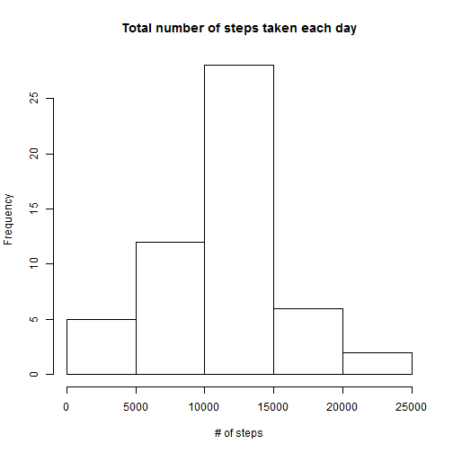
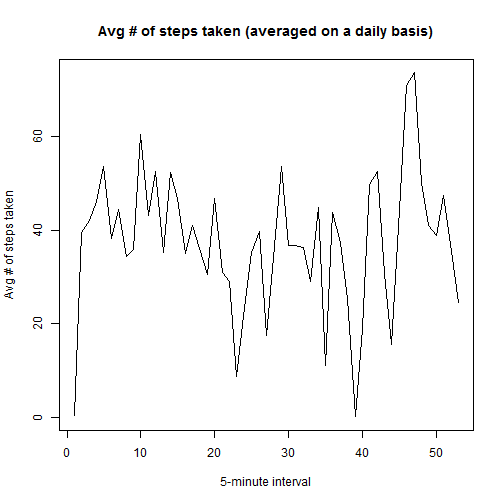

PA1_template R markdown file
============================

Make a histogram of the total number of steps taken each day
============================================================


```r
#read data
data <- read.csv("C:\\EDA\\R\\markdown\\Activity.csv")
#data

# drop na as the req states to ignore the NAs
subdata <- data[complete.cases(data),]
#subdata

# bin data by date and apply sum on each bin. Also, remove na.
#agdata <- aggregate(data$steps, by=list((substr(data$date,1,10))), sum, na.rm=TRUE)
agdata <- aggregate(subdata$steps, by=list((substr(subdata$date,1,10))), sum, na.rm=TRUE)
#agdata

# check the column names
#names(agdata)

# plot histogram that shows the frequency of the data in certain ranges
hist(agdata$x, main="Total number of steps taken each day", xlab="# of steps")
```

 

Calculate and report the mean and median total number of steps taken per day
============================================================================


```r
# note we can use agdata from previous steps
#agdata
mean (agdata$x)
```

```
## [1] 10766
```

```r
median (agdata$x)
```

```
## [1] 10765
```


Make a time series plot of the 5-minute interval and the average number of steps taken
======================================================================================


```r
# it does not say to ignore the NA for this part 
avgdata <- aggregate(subdata$steps, by=list((substr(subdata$date,1,10))), mean, na.rm=FALSE)
avgdata
```

```
##       Group.1       x
## 1  2012-10-02  0.4375
## 2  2012-10-03 39.4167
## 3  2012-10-04 42.0694
## 4  2012-10-05 46.1597
## 5  2012-10-06 53.5417
## 6  2012-10-07 38.2465
## 7  2012-10-09 44.4826
## 8  2012-10-10 34.3750
## 9  2012-10-11 35.7778
## 10 2012-10-12 60.3542
## 11 2012-10-13 43.1458
## 12 2012-10-14 52.4236
## 13 2012-10-15 35.2049
## 14 2012-10-16 52.3750
## 15 2012-10-17 46.7083
## 16 2012-10-18 34.9167
## 17 2012-10-19 41.0729
## 18 2012-10-20 36.0938
## 19 2012-10-21 30.6285
## 20 2012-10-22 46.7361
## 21 2012-10-23 30.9653
## 22 2012-10-24 29.0104
## 23 2012-10-25  8.6528
## 24 2012-10-26 23.5347
## 25 2012-10-27 35.1354
## 26 2012-10-28 39.7847
## 27 2012-10-29 17.4236
## 28 2012-10-30 34.0938
## 29 2012-10-31 53.5208
## 30 2012-11-02 36.8056
## 31 2012-11-03 36.7049
## 32 2012-11-05 36.2465
## 33 2012-11-06 28.9375
## 34 2012-11-07 44.7326
## 35 2012-11-08 11.1771
## 36 2012-11-11 43.7778
## 37 2012-11-12 37.3785
## 38 2012-11-13 25.4722
## 39 2012-11-15  0.1424
## 40 2012-11-16 18.8924
## 41 2012-11-17 49.7882
## 42 2012-11-18 52.4653
## 43 2012-11-19 30.6979
## 44 2012-11-20 15.5278
## 45 2012-11-21 44.3993
## 46 2012-11-22 70.9271
## 47 2012-11-23 73.5903
## 48 2012-11-24 50.2708
## 49 2012-11-25 41.0903
## 50 2012-11-26 38.7569
## 51 2012-11-27 47.3819
## 52 2012-11-28 35.3576
## 53 2012-11-29 24.4688
```

```r
tsplot <- ts(avgdata)
```

```
## Warning: NAs introduced by coercion
```

```r
#tsplot
plot.ts(avgdata$x, main="Avg # of steps taken (averaged on a daily basis)", xlab="5-minute interval", ylab = "Avg # of steps taken")
```

 

Which 5-minute interval contains maximum number of steps?
=========================================================


```r
max(avgdata$Group.1, avgdata$x)
```

```
## [1] "73.59"
```

Total # of NAs
==============


```r
sum( is.na(data) )
```

```
## [1] 2304
```

```r
#data[is.na(data)] <- 0

#mx <- ddply(mx, .(groups), function(df) {df$value[is.na(df$value)] <- mean(df$value, na.rm=TRUE); return(df)})
library (plyr)
mymean <- function(data) { replace(data, is.na(data), mean(data, na.rm=TRUE) ) }

data2 <- ddply(data, .(groups), function(data){ data$steps[is.na(data$steps)] <- mean(data$steps, na.rm=TRUE); return(data) } )
```

```
## Error: object 'groups' not found
```

```r
data2
```

```
## Error: object 'data2' not found
```
